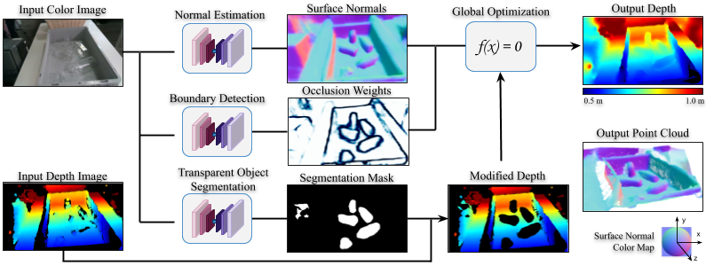

# Projects

---
## ClearGrasp: 3D Shape Estimation of Transparent Objects for Manipulation

A deep learning approach for estimating accurate 3D geometry of transparent objects from a single RGB-D image for robotic manipulation. Given a single RGB-D image of transparent objects, ClearGrasp uses deep convolutional networks to infer surface normals, masks of transparent surfaces, and occlusion boundaries. It then uses these outputs to refine the initial depth estimates for all transparent surfaces in the scene

[Paper](https://arxiv.org/abs/1910.02550)

[Clear Grasp homepage](https://sites.google.com/view/cleargrasp)

